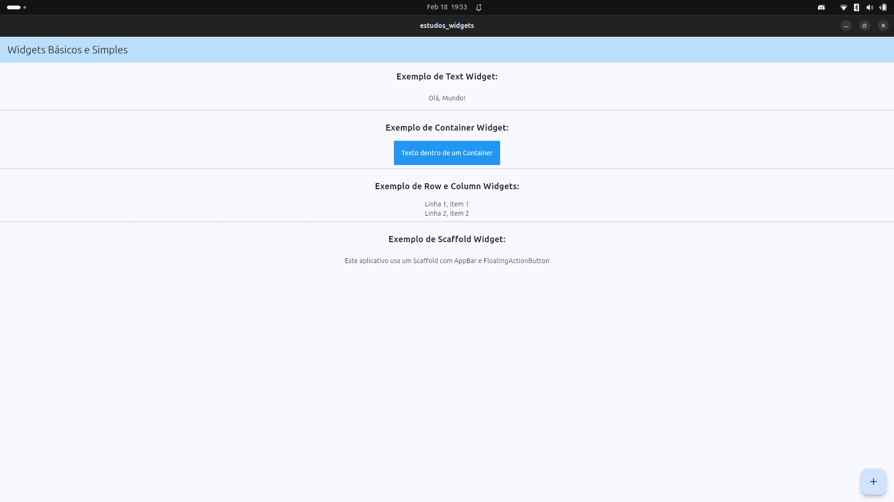

# Estudo de Widgets Básicos - Flutter

Este projeto faz parte do meu aprendizado em **Desenvolvimento Mobile** (atualmente no 4º semestre de ADS). O objetivo principal foi explorar os widgets fundamentais do Flutter, aplicando conceitos de **Clean Code** e **Componentização**.

## Refactoring & Architecture
Diferente da abordagem inicial em arquivo único, este projeto foi estruturado para garantir a **Scalability** (escalabilidade) e **Maintainability** (manutenibilidade):

* **Separation of Concerns**: Cada seção da interface (Text, Container, Row/Column) foi isolada em um componente próprio na pasta `lib/components/`.
* **Custom Widgets**: Criação de classes reutilizáveis que estendem `StatelessWidget`.

## Running on Linux
O projeto foi desenvolvido e testado nativamente em ambiente **Linux**, utilizando o **VS Code** para manter o fluxo de trabalho leve e eficiente, evitando o uso de emuladores pesados ou ferramentas que consomem muita memória.

## Screenshot

